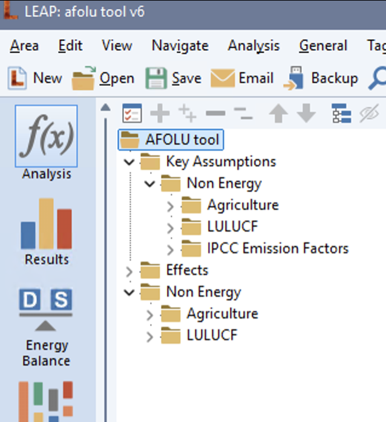

[Previous]({{ '/setup/software-requirements/' | relative_url }})
## Installation

The AFOLU tool is distributed as a LEAP sample model. To install the AFOLU tool in LEAP:

1. **Download the *AFOLU_v[# CURRENT VERSION].leap file*** from [GitHub](https://github.com/sei-international/AFOLU-tool).  
2. Install the tool in your LEAP software, by navigating to the **Downloads** folder (or wherever you saved the *AFOLU.leap* file) and double clicking on the downloaded _.leap_-file. Alternatively, you can also open the model from the LEAP-interface under "_Area>Install from File.._"  

This will open the default AFOLU tool in LEAP. The AFOLU consists of a non-energy LEAP-model  for a hypothetical country with a dry climate, with the following branch structure:

**AFOLU tool**
- Key assumptions
  - Non Energy
    - Agriculture
    - LULUCF
    - IPCC Emission Factors
- Non Energy
  - Agriculture
  - LULUCF

**You are now ready to adapt the model to your national or regional context.**

[Next]({{ '/setup/agriculture/adding-national-data/' | relative_url }})

